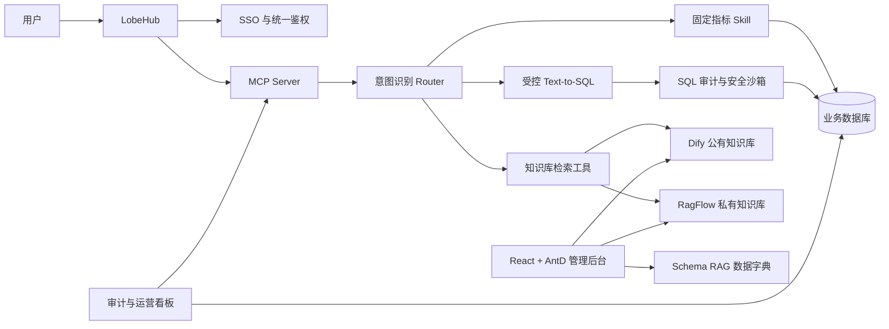

# 政企系统 AI 项目开发方案

> **For agentic workers:** REQUIRED SUB-SKILL: Use superpowers:subagent-driven-development (recommended) or superpowers:executing-plans to implement this plan task-by-task. Steps use checkbox (`- [ ]`) syntax for tracking.

**Goal:** 建设面向政企系统的一体化 AI 能力平台，覆盖智能取数、知识库检索、MCP 工具封装、管理后台、权限隔离、审计监控与 LobeHub 集成。

**Architecture:** 采用“统一入口 + MCP 工具层 + 能力服务层 + 数据/知识底座”的分层架构。LobeHub 作为用户入口，MCP Server 统一暴露工具能力，后端能力服务分别承载 Router、固定指标 Skill、受控 Text-to-SQL、知识库检索、管理后台与审计监控。

**Tech Stack:** LobeHub、MCP Server、FastAPI、React、Ant Design、Dify、RagFlow、DeepDoc、向量数据库、bge-reranker-v2-m3、sqlglot、关系型数据库、SSO/RBAC。

---

## 1. 需求来源与范围

本方案依据目录下《政企系统AI项目-需求清单.xlsx》整理，需求共覆盖 16 项交付任务，可归并为 6 个建设板块：

1. 智能取数工具开发：业务表梳理、Text-to-SQL、固定指标接口、SQL 安全审计。
2. 知识库检索工具开发：公有知识库、私有知识库、版面感知解析、混合检索与重排。
3. MCP 工具集成：将取数与检索能力封装为标准工具，支持统一调用。
4. 知识库管理平台：知识条目管理、业务口径管理、异步向量化任务监控。
5. 权限与审计：企业级 RBAC、公私库隔离、SQL 与 RAG 调用审计、运营看板。
6. LobeHub 集成：统一入口、SSO、安全配置与菜单嵌入。

## 2. 关键假设

- 政企系统已有可访问的业务数据库，并允许导出表结构、字段说明和业务口径。
- 高频指标查询优先使用确定性接口，不依赖大模型生成 SQL，以保证核心数值准确。
- 非标查询通过受控 Text-to-SQL 处理，但只允许只读查询、白名单表访问和强制分页/限流。
- 公有知识库用于制度、管理办法、通用资料；私有知识库按部门或个人隔离。
- Dify 与 RagFlow 均可部署到项目环境；若最终只保留一个引擎，需要在详细设计阶段裁剪。
- LobeHub 已作为统一 AI 工作台，项目只负责菜单、入口、SSO 与工具接入，不重建聊天客户端。

## 3. 推荐实施路线

### 方案 A：一次性全量建设

- 优点：整体架构一次成型，减少后续集成返工。
- 缺点：需求面广、依赖多、验收周期长，容易在 Text-to-SQL、知识库、权限、SSO 之间互相阻塞。

### 方案 B：MVP 先行，分阶段增强（推荐）

- 优点：先交付可演示、可验证的核心闭环，再逐步补齐复杂能力，风险可控。
- 缺点：需要明确每期边界，并接受部分高级能力延后上线。

### 方案 C：先平台后台，后 AI 能力

- 优点：权限、数据治理、管理流程较早稳定。
- 缺点：短期看不到 AI 使用效果，难以及早验证取数和检索准确率。

**推荐选择方案 B。** 先完成“LobeHub 入口 → MCP 工具 → 固定指标查询/知识库检索 → 审计记录”的最小闭环，再迭代 Text-to-SQL、私有知识库、管理后台和运营看板。

## 4. 总体架构

### 核心原则

- 确定性优先：高频、关键、财务或工程进度类指标使用硬查询接口。
- AI 受控使用：Text-to-SQL 只处理非标取数，且必须经过语义上下文、SQL 静态校验和执行沙箱。
- 公私隔离：知识库按数据集、部门、用户做权限控制，检索前校验权限，检索后记录审计。
- 工具标准化：对外统一通过 MCP 暴露工具，避免客户端直接耦合后端实现。
- 可观测：所有 Router 命中、SQL 执行、RAG 检索、向量化任务都应留痕。

## 5. 模块设计

### 5.1 智能取数模块

**目标：** 支持自然语言查询政企业务数据，并确保高频指标准确、动态查询安全。

**建设内容：**

- 业务表梳理与口径映射：导出 DDL、字段说明、指标口径、表关系和示例问法，形成 Schema RAG 数据字典。
- 意图识别 Router：识别“固定报表/高频指标”“动态取数”“规章制度/知识问答”三类请求。
- 高频指标 Skill：对建设进度、完成量等核心指标编写 FastAPI 硬查询接口。
- Text-to-SQL 管线：基于 Schema RAG、少样本样例、业务口径生成 SQL。
- SQL 安全沙箱：使用 sqlglot 做 AST 静态校验，拦截 DDL/DML、危险函数、非白名单表、无条件大表扫描。

**验收标准：**

- 高频指标接口返回结果与人工 SQL 校验一致。
- 动态 SQL 仅允许 SELECT 类查询，并强制表白名单、字段白名单、行数限制。
- Router 能输出命中类型、置信度、路由目标和审计记录。

### 5.2 知识库检索模块

**目标：** 支持制度、管理办法、项目资料等文档的公有/私有知识问答。

**建设内容：**

- 公有知识库：基于 Dify 搭建公共资料库，支持上传、解析、切片、向量化、检索。
- 私有知识库：基于 RagFlow 搭建部门/个人知识库，实现租户级逻辑隔离。
- 版面感知解析：使用 RagFlow DeepDoc 策略处理复杂版式文档，降低表格、标题、条款切片断裂。
- 混合检索：配置 Dense 向量召回与 Sparse 全文召回，再使用 bge-reranker-v2-m3 重排。
- 检索工具封装：将 Dify 与 RagFlow 检索能力分别封装为 MCP Tool。

**验收标准：**

- 公有库和私有库检索结果按权限隔离，不越权返回片段。
- 典型制度问答能返回引用来源、片段摘要和置信度。
- 对复杂版面文档，标题、条款、表格不发生明显逻辑截断。

### 5.3 MCP 工具层

**目标：** 为 LobeHub 等客户端提供统一、标准、可鉴权的 AI 工具调用入口。

**建设内容：**

- MCP Server：部署标准协议服务，统一注册取数、固定指标、Text-to-SQL、公有检索、私有检索工具。
- 鉴权透传：接收 LobeHub/SSO 用户身份，将用户、角色、部门、租户信息传递到能力服务。
- 流式输出：对长耗时检索、SQL 解释、问答生成支持流式返回。
- 错误规范：统一工具错误码、用户提示语、审计日志字段。

**验收标准：**

- LobeHub 能发现并调用 MCP 工具。
- 工具调用携带用户身份，并在后端完成权限校验。
- 调用失败时返回可理解的错误信息，不暴露数据库敏感细节。

### 5.4 管理后台

**目标：** 提供知识、业务口径、向量化任务和权限的运营管理能力。

**建设内容：**

- 知识条目管理：新增、编辑、删除、分类、预览、批量导入。
- 业务口径管理：维护表、字段、指标、别名、示例问法、表关系。
- 向量化任务管理：查看解析/切片/向量化状态，支持失败重试、刷新、异常日志查看。
- RBAC 权限管理：用户、角色、部门、数据集权限矩阵。
- 审计看板：展示 Router 命中率、固定指标命中率、SQL 执行记录、RAG 检索日志。

**验收标准：**

- 管理员可完成知识库从上传到检索可用的全流程。
- 权限变更后立即影响 MCP 工具查询范围。
- 看板能按时间、用户、工具、数据集筛选调用记录。

### 5.5 LobeHub 集成

**目标：** 将平台能力以统一入口嵌入 LobeHub，实现一站式使用。

**建设内容：**

- 配置管理后台独立访问链接。
- 通过 iframe 或跳转方式嵌入 LobeHub 菜单。
- 接入 SSO，统一登录态和用户身份。
- 配置访问白名单、回调地址、会话超时和安全策略。

**验收标准：**

- 用户从 LobeHub 可无二次登录访问管理后台。
- 非授权用户无法访问管理后台或越权调用工具。
- 链接、菜单、权限、审计链路可完整追踪。

## 6. 分阶段开发计划

### 阶段 0：启动与需求澄清（第 1 周）

**目标：** 固化范围、数据源、部署约束和验收口径。

- [ ] 确认业务数据库清单、只读账号、网络访问方式。
- [ ] 确认首批高频指标范围，例如建设进度、完成量、项目状态统计。
- [ ] 确认首批知识库文档样本，至少包含制度类、管理办法类、表格类文档。
- [ ] 确认 LobeHub、SSO、Dify、RagFlow 的部署方式和环境边界。
- [ ] 输出《需求澄清纪要》和《一期验收用例清单》。

**验证：** 需求方确认一期范围，技术方可访问样例数据库与样例文档。

### 阶段 1：基础设施与最小闭环（第 2-3 周）

**目标：** 打通 LobeHub → MCP → 固定指标/知识库 → 审计 的可演示链路。

- [ ] 部署 MCP Server 基础服务和工具注册机制。
- [ ] 搭建 FastAPI 能力服务骨架，提供健康检查、鉴权上下文、统一错误响应。
- [ ] 实现 2-3 个高频指标硬查询接口。
- [ ] 搭建 Dify 公有知识库，导入首批公共文档。
- [ ] 封装公有知识库检索 MCP Tool。
- [ ] 接入 LobeHub 工具调用和管理后台入口占位页。
- [ ] 记录 MCP 调用、用户、工具名、耗时、结果状态。

**验证：** 用户可在 LobeHub 发起指标查询和制度问答，后台可查到调用日志。

### 阶段 2：Schema RAG 与受控 Text-to-SQL（第 4-6 周）

**目标：** 支持非标业务取数，并建立 SQL 安全边界。

- [ ] 梳理业务表、字段、表关系、指标口径和示例问法。
- [ ] 建立 Schema RAG 数据字典，支持按问题检索相关表字段。
- [ ] 实现 Router 初版，区分固定指标、动态取数、知识问答。
- [ ] 实现 Text-to-SQL 生成链路，生成 SQL、解释口径、返回候选表字段依据。
- [ ] 集成 sqlglot 静态校验，限制只读查询、白名单表、最大行数、超时时间。
- [ ] 建立 SQL 测试集，覆盖单表、多表、聚合、时间范围、模糊条件。

**验证：** Text-to-SQL 测试集通过率达到项目约定阈值；危险 SQL 被拦截并有审计记录。

### 阶段 3：私有知识库与检索增强（第 7-8 周）

**目标：** 支持公私知识库隔离和更高质量检索。

- [ ] 搭建 RagFlow 私有知识库，按部门/个人建立数据集隔离。
- [ ] 配置 DeepDoc 版面感知解析策略，验证复杂文档切片效果。
- [ ] 配置 Dense + Sparse 双路召回。
- [ ] 集成 bge-reranker-v2-m3 重排。
- [ ] 封装私有知识库检索 MCP Tool。
- [ ] 实现检索前权限过滤和检索后引用审计。

**验证：** 不同用户只能检索授权知识库；典型问答返回来源引用且排序符合人工评估。

### 阶段 4：管理后台与权限体系（第 9-11 周）

**目标：** 支持运营人员自助维护知识、业务口径、任务和权限。

- [ ] 建设 React + AntD 管理后台基础框架。
- [ ] 实现知识条目新增、编辑、删除、分类、预览、批量导入。
- [ ] 实现业务表、字段、指标、别名、示例问法维护。
- [ ] 实现解析与向量化任务队列状态页，支持失败重试与异常查看。
- [ ] 实现 RBAC 用户、角色、部门、数据集权限矩阵。
- [ ] 将权限结果接入 MCP 工具层。

**验证：** 管理员可完成文档上传、向量化、权限配置、检索验证的闭环操作。

### 阶段 5：审计看板、SSO 与上线验收（第 12 周）

**目标：** 完成企业级入口、安全和运营监控能力。

- [ ] 接入 SSO，完成 LobeHub 到管理后台的统一登录。
- [ ] 完成 iframe 或跳转式菜单嵌入。
- [ ] 建设 Router 命中率、固定指标命中率、SQL 执行、RAG 检索日志看板。
- [ ] 完成安全策略配置，包括回调地址、会话超时、访问白名单。
- [ ] 执行全链路验收测试和性能压测。
- [ ] 输出部署文档、运维手册、验收报告。

**验证：** 通过一期验收用例，形成上线版本和回滚预案。

## 7. 交付物清单

| 类别 | 交付物 | 说明 |
| --- | --- | --- |
| 文档 | 需求澄清纪要 | 明确一期范围、数据源、指标、知识库样本、验收标准 |
| 文档 | 数据字典与业务口径清单 | 表结构、字段说明、指标口径、表关系、示例问法 |
| 服务 | MCP Server | 统一暴露取数、检索、问答工具 |
| 服务 | FastAPI 能力服务 | Router、固定指标接口、Text-to-SQL、安全校验 |
| 服务 | Dify 公有知识库 | 公共制度和管理办法检索 |
| 服务 | RagFlow 私有知识库 | 部门/个人知识库与 DeepDoc 解析 |
| 前端 | 管理后台 | 知识、口径、任务、权限、审计管理 |
| 集成 | LobeHub 入口 | 菜单嵌入、SSO、工具调用 |
| 安全 | RBAC 与审计日志 | 用户、角色、数据集权限与调用留痕 |
| 测试 | 验收用例与测试报告 | 指标准确率、SQL 安全、检索质量、权限隔离 |

## 8. 测试与验收策略

### 8.1 智能取数测试

- 高频指标：每个接口准备人工 SQL 对照样例，校验数值一致性。
- Text-to-SQL：建立自然语言问题集，覆盖单表、多表、聚合、时间筛选、状态筛选。
- SQL 安全：构造 DROP、UPDATE、INSERT、DELETE、跨库访问、无 LIMIT 大查询等拦截用例。

### 8.2 知识库测试

- 切片质量：抽检复杂版面文档，确认标题、条款、表格上下文完整。
- 检索质量：准备标准问答集，人工评估召回准确率、引用可信度、排序质量。
- 权限隔离：使用不同角色账号验证公有库、部门库、个人库访问边界。

### 8.3 集成测试

- LobeHub 调用 MCP 工具成功。
- SSO 登录态可透传到 MCP 和后台服务。
- 工具调用、SQL 执行、检索结果均可在审计看板查询。

### 8.4 非功能测试

- 响应时间：固定指标接口优先满足秒级响应；RAG 和 Text-to-SQL 按场景设定超时。
- 并发能力：按试点用户量设置并发压测目标。
- 安全合规：敏感字段脱敏、数据库只读账号、权限越权拦截、日志不记录敏感原文。

## 9. 风险与应对

| 风险 | 影响 | 应对 |
| --- | --- | --- |
| 业务表口径不清 | Text-to-SQL 准确率低 | 先建设数据字典与高频指标硬查询，动态取数逐步扩展 |
| 文档版式复杂 | 知识库切片断裂 | 使用 DeepDoc 解析并建立人工抽检流程 |
| 公私库权限复杂 | 越权风险 | 检索前强制权限过滤，检索后审计留痕 |
| 大模型生成 SQL 不可控 | 数据安全风险 | sqlglot AST 校验、白名单、只读账号、限流、超时 |
| Dify 与 RagFlow 双平台维护成本高 | 运维复杂 | 一期保留清晰边界，二期根据效果决定是否收敛 |
| SSO/iframe 安全限制 | 集成延期 | 阶段 0 提前确认 LobeHub 安全策略与回调配置 |

## 10. 需要进一步确认的问题

1. 首批高频指标清单和对应人工校验 SQL。
2. 业务数据库类型、网络连通方式、只读账号和脱敏要求。
3. Dify、RagFlow、向量数据库、大模型服务的部署形态。
4. SSO 协议类型，例如 OAuth2、OIDC、SAML 或企业内部统一认证。
5. 一期用户范围、角色模型、部门/租户隔离规则。
6. 验收指标阈值，例如 Text-to-SQL 准确率、知识库命中率、响应时间。

## 11. 里程碑建议

| 里程碑 | 时间 | 验收重点 |
| --- | --- | --- |
| M0 启动完成 | 第 1 周 | 范围、数据源、样本文档、验收用例确认 |
| M1 最小闭环 | 第 3 周 | LobeHub 调用固定指标和公有知识库检索 |
| M2 动态取数 | 第 6 周 | Router、Schema RAG、Text-to-SQL、安全沙箱 |
| M3 检索增强 | 第 8 周 | 私有知识库、DeepDoc、混合检索、重排 |
| M4 管理后台 | 第 11 周 | 知识/口径/任务/RBAC 管理闭环 |
| M5 上线验收 | 第 12 周 | SSO、审计看板、全链路测试、上线文档 |

## 12. 自查结论

- 已覆盖需求清单中的 16 项交付任务，并归并到智能取数、知识库、MCP、管理后台、权限审计、LobeHub 集成 6 个模块。
- 方案优先选择 MVP 分阶段交付，避免一次性建设导致多依赖并行阻塞。
- 已明确高风险点，包括 SQL 安全、权限隔离、业务口径、文档切片、SSO 集成。
- 待确认项集中在数据源、首批指标、部署形态、权限模型和验收阈值，适合在阶段 0 完成。
